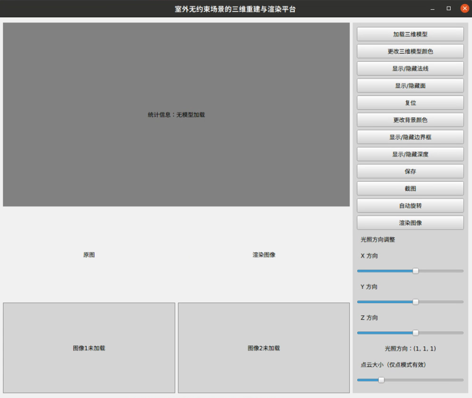
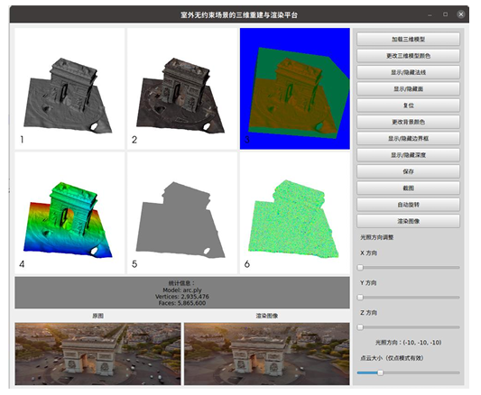
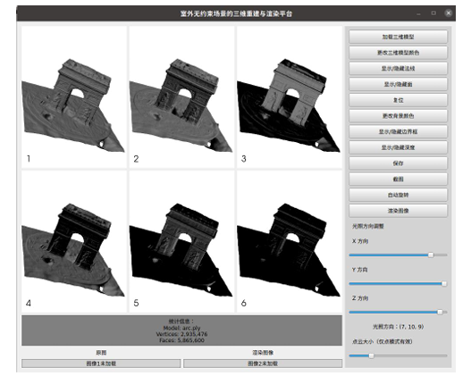

**⚠️ This repository is no longer maintained**

This repository implements a platform primarily focused on 3D model loading, image rendering, and information visualization functionalities. It is designed to facilitate the handling and visualization of outdoor unconstrained scene reconstructions.The related functionalities are implemented as follows：
- **Complete interface**  
  

- **Related functionality implementation**  
  

- **Implementation of lighting variation**  
  

# 💻 Installation
Make sure you have Git installed. Then run the following command to clone the repository:
```bash
git clone https://github.com/mowangmodi/A-3D-Reconstruction-and-Rendering-Platform-for-Unconstrained-Outdoor-Scenes.git
```

- You can create the Conda environment using either of the following methods:

```bash
conda env create -f environment.yaml
```
# Run
```bash
python gui.py
```
